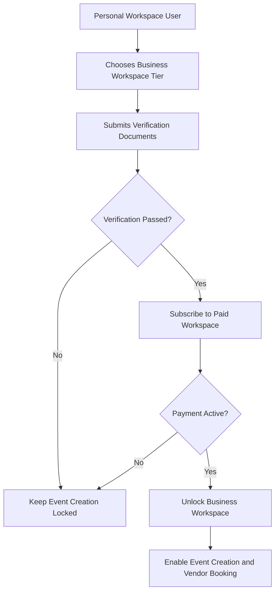
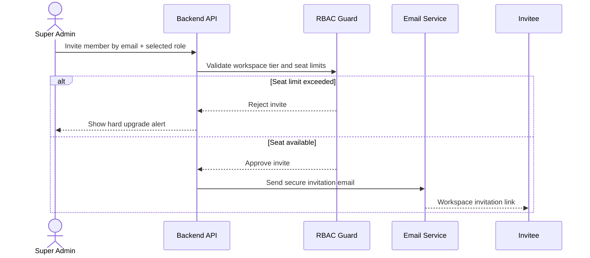
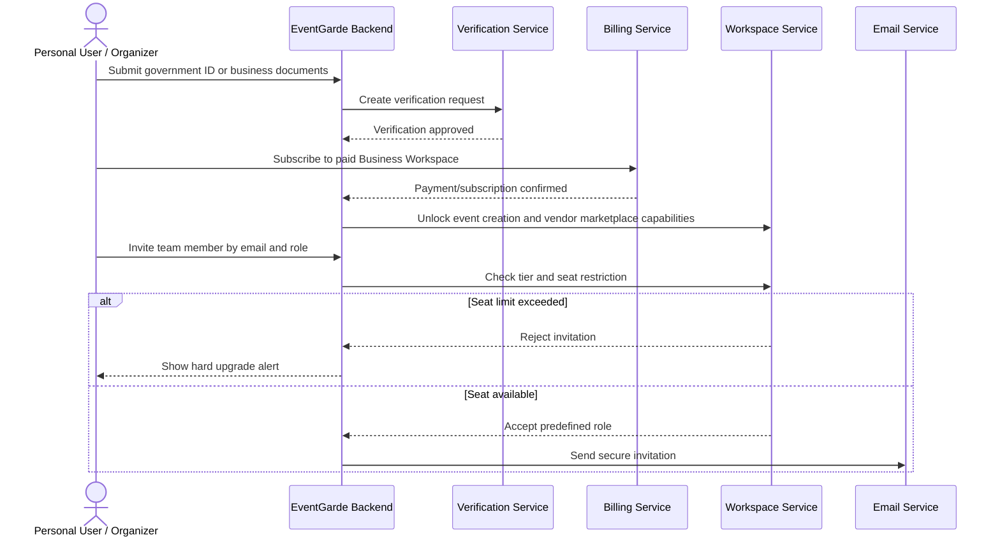
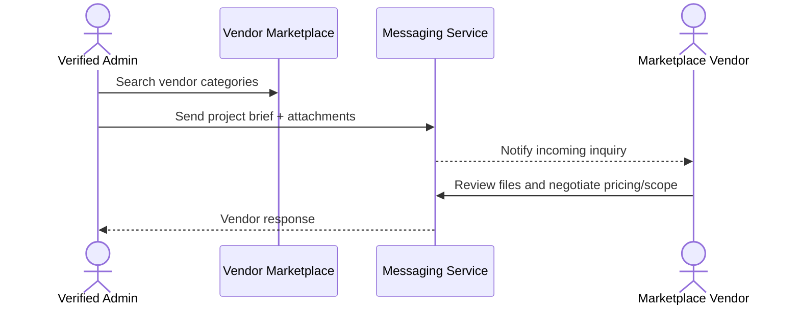
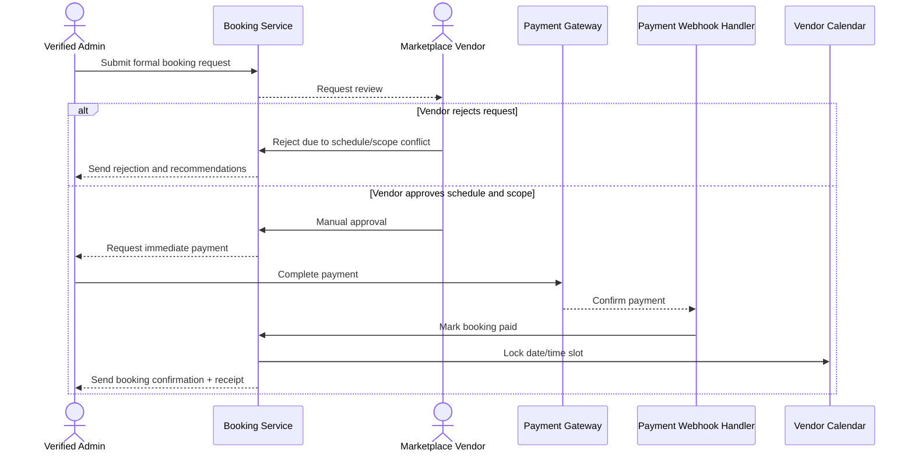
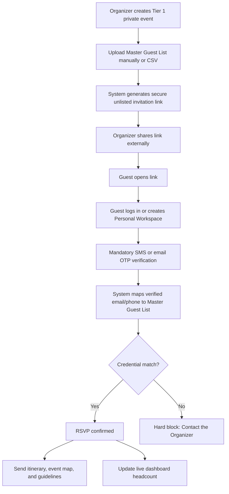
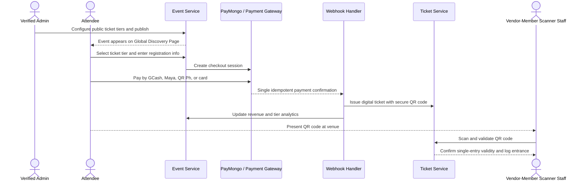
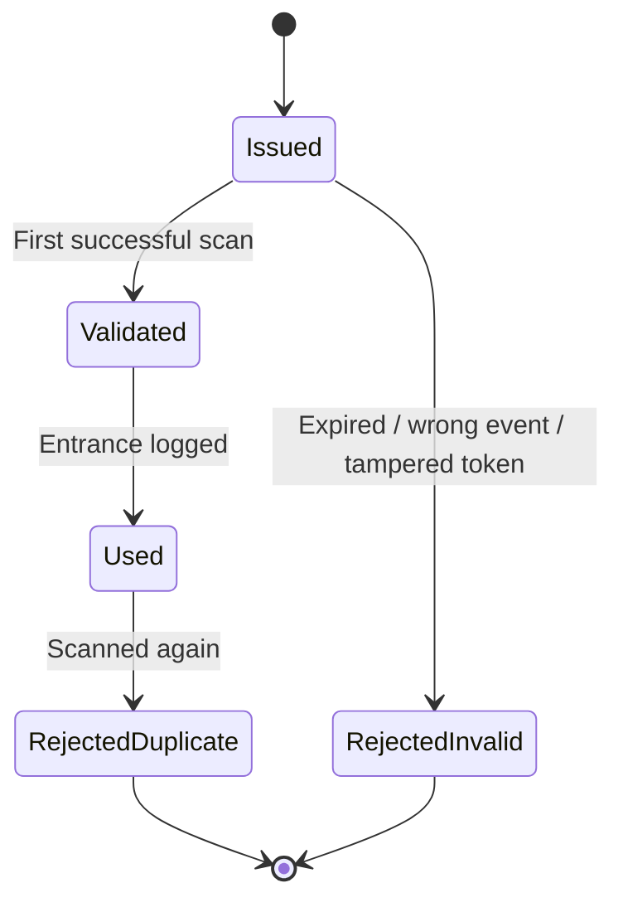
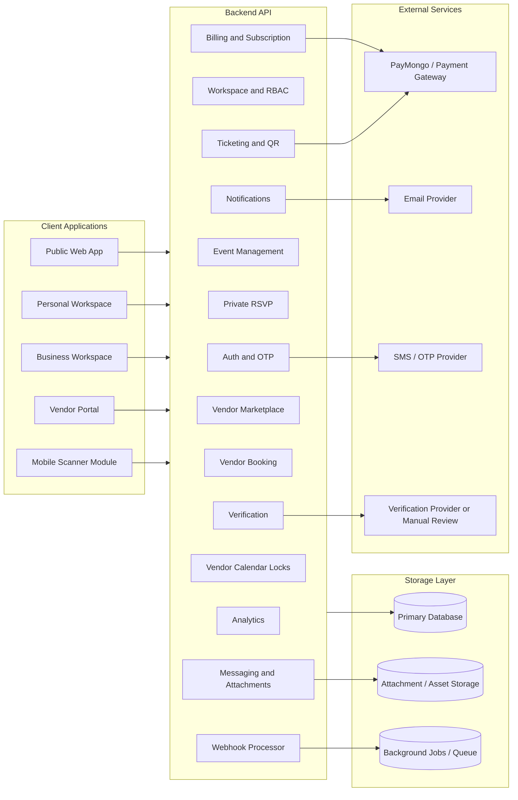
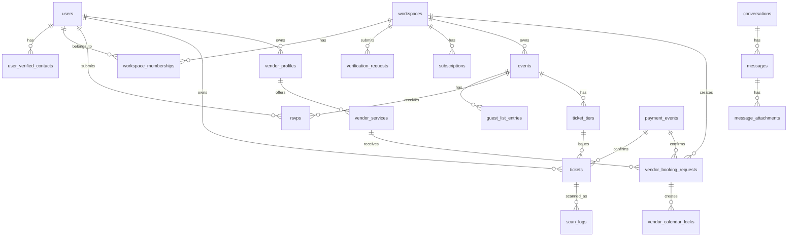

# EventGarde Architecture - Combined Markdown

This combined file mirrors the separate Markdown files in this folder.


---

<!-- Source file: README.md -->

# EventGarde Architecture Documentation

This folder converts the EventGarde PRD and platform workflow diagram into developer-ready Markdown documentation.

## What EventGarde Is

EventGarde is an integrated event management platform for attendees, verified organizers, and service vendors. It combines:

- personal event discovery and ticket/RSVP management;
- verified business workspaces for event creation and operations;
- private RSVP flows with strict verified-contact matching;
- public ticketing with payment and QR-code entry control;
- vendor discovery, inquiry, booking, payment-gated calendar locking, and messaging.

## Core Rule

A free Personal Workspace can browse events, buy tickets, RSVP to private events, and use the marketplace as a buyer, but it can never create an event. Event creation is unlocked only after verification and paid Business Workspace subscription.

## Documentation Index

1. [Product Overview](./01_product_overview.md)
2. [System Rules and Invariants](./02_system_rules.md)
3. [Workspace and Subscription Model](./03_workspaces_and_tiers.md)
4. [RBAC and Permissions](./04_rbac_permissions.md)
5. [Core Workflows](./05_core_workflows.md)
6. [Module Architecture](./06_module_architecture.md)
7. [Recommended Data Model](./07_recommended_data_model.md)
8. [Recommended API Surface](./08_recommended_api_surface.md)
9. [Frontend Screens and Navigation](./09_frontend_screens.md)
10. [Developer Build Plan](./10_developer_build_plan.md)
11. [Source Mapping](./11_source_mapping.md)

## Suggested Repository Placement

```txt
EventGarde/
├── docs/
│   ├── README.md
│   ├── 01_product_overview.md
│   ├── 02_system_rules.md
│   ├── 03_workspaces_and_tiers.md
│   ├── 04_rbac_permissions.md
│   ├── 05_core_workflows.md
│   ├── 06_module_architecture.md
│   ├── 07_recommended_data_model.md
│   ├── 08_recommended_api_surface.md
│   ├── 09_frontend_screens.md
│   ├── 10_developer_build_plan.md
│   └── 11_source_mapping.md
├── frontend/
└── backend/
```

## Implementation Note

The PRD defines business rules, workflows, tiers, permissions, and product behavior. The data model, API surface, and module architecture in this folder are recommended implementation translations for the coder. Adjust naming and framework details to match the actual stack.


---

<!-- Source file: 01_product_overview.md -->

# 01 - Product Overview

## Purpose

EventGarde is an integrated B2B/B2C event management ecosystem. It connects:

- **Attendees** who browse events, buy tickets, receive private invitations, and manage RSVP/tickets.
- **Verified organizers** who create events, track RSVPs, configure tickets, manage staff, book vendors, and run event-day access control.
- **Marketplace vendors** who provide services such as catering, photography, venue support, styling, production, and similar event services.
- **Vendor-Members** who are internal event staff assigned by organizers to fulfill event-day tasks such as entrance scanning.

The system exists to centralize event logistics, ticketing, RSVP validation, vendor procurement, payments, and event-day execution.

## Main Product Areas

```txt
EventGarde Platform
├── Public Experience
│   ├── Landing page
│   ├── Global Discovery Page
│   ├── Public event details
│   └── Ticket checkout
├── Personal Workspace
│   ├── Browse public events
│   ├── Buy tickets
│   ├── Receive private RSVP links
│   ├── Confirm RSVP after OTP validation
│   └── Manage digital tickets
├── Verified Business Workspace
│   ├── Event creation
│   ├── Guest lists and RSVP dashboards
│   ├── Ticket tier configuration
│   ├── Revenue and attendee analytics
│   ├── Vendor marketplace booking
│   ├── Team member invitations
│   └── Billing, subscription, and verification
├── Vendor Marketplace
│   ├── Vendor storefronts
│   ├── Service listings
│   ├── Direct inquiries
│   ├── File attachments
│   ├── Manual booking approval
│   └── Payment-gated calendar locks
└── Event-Day Operations
    ├── QR-code ticket validation
    ├── Single-entry enforcement
    ├── Attendance logging
    └── Role-based scanner access
```

## User Types

| User Type | Description | Main Capabilities |
|---|---|---|
| Personal Workspace User / Attendee | Free consumer account | Browse events, buy tickets, RSVP to private events, access marketplace for personal use |
| Verified Business Workspace Owner / Super Admin | Verified paid organizer | Manage billing, verification, subscription, members, events, and all workspace assets |
| Admin / Event Manager | Business workspace member | Create and modify events, manage ticketing, monitor analytics, communicate with/book marketplace vendors |
| Vendor-Member / Internal Staff | Internal staff under organizer workspace | Fulfill event logistics and scan QR codes for entrance verification |
| Marketplace Vendor | Independent external service provider | Manage storefront, respond to inquiries, negotiate, approve/reject bookings, maintain calendar availability |

## Product Boundary

The platform is not just a ticketing app. It is a workspace-based event operations system with strict account gating, tier-based event capabilities, verified RSVP matching, vendor procurement, and event-day access control.


---

<!-- Source file: 02_system_rules.md -->

# 02 - System Rules and Invariants

These are hard rules. Treat them as backend-enforced invariants, not frontend-only UI restrictions.

## Global Invariants

| Rule | Requirement | Backend Enforcement |
|---|---|---|
| No free event creation | A Personal Workspace can never create events | Reject event creation unless workspace is verified, paid, and business-type |
| Event creation is gated | Verification + subscription are required | Check workspace verification status and active subscription before showing or accepting create-event actions |
| Tier defines capability boundaries | A workspace tier controls event categories, listing visibility, PAX limits, ticketing capability, and seat limits | Validate event category, event visibility, ticketing, and seat actions against tier |
| No mixed-tier capabilities | Organizers cannot combine Tier 1 privacy with Tier 3 ticketing or public discovery unless the tier allows it | Validate capabilities per event and workspace tier |
| RBAC roles are exhaustive | Only Super Admin, Admin, and Vendor-Member exist inside Business Workspaces | Use enum roles only; reject custom roles |
| Tier 2 Admin cap | Tier 2 allows up to 5 Admin seats | Count active Admin memberships before invite/role change |
| Tier 3 seats are unlimited | Tier 3 has unlimited RBAC seats | No Admin seat cap for Tier 3 |
| RSVP matching uses verified contacts only | Match private guests by verified email or phone, never by name | Store name as display-only; matching key must be verified email/phone |
| Tier 1 RSVP mismatch is terminal | No manual approval fallback for private RSVP mismatches | Return hard block message; do not expose manual override path |
| Vendor booking is manual approval only | Vendor bookings are never auto-accepted | Booking request remains pending until vendor approves/rejects |
| Calendar lock is payment-gated | Vendor approval alone does not reserve the vendor calendar | Create calendar lock only after approved booking and confirmed payment webhook |
| Ticket issuance is webhook-driven | Tickets and dashboard revenue sync after payment confirmation | Use idempotent payment webhook handling |
| QR ticket is single-entry | Door scanning must prevent duplicate entry | Mark ticket as used after first valid scan |

## Critical Permission Checks

Every protected action should run through a server-side authorization guard.

```ts
// Pseudocode only
function canCreateEvent(user, workspace, eventCategory) {
  return workspace.type === 'business'
    && workspace.verificationStatus === 'verified'
    && workspace.subscriptionStatus === 'active'
    && ['super_admin', 'admin'].includes(user.role)
    && categoryAllowedForTier(eventCategory, workspace.tier)
}
```

## Never Trust the UI

The frontend may hide restricted buttons, but the backend must still reject restricted requests. This is required for:

- creating events;
- publishing public events;
- importing guest lists;
- confirming RSVPs;
- creating ticket tiers;
- booking vendors;
- locking vendor calendars;
- scanning tickets;
- inviting workspace members;
- changing member roles;
- accessing billing and verification documents.


---

<!-- Source file: 03_workspaces_and_tiers.md -->

# 03 - Workspace and Subscription Model

## Workspace Types

| Workspace Type | Free/Paid | Verification Required | Can Create Events | Main Use |
|---|---:|---:|---:|---|
| Personal Workspace | Free | No | No | Attending events, buying tickets, RSVPing, browsing marketplace for personal use |
| Verified Business Workspace | Paid | Yes | Yes | Organizing events, managing guests, ticketing, booking vendors, managing staff |

## Upgrade Path

A Personal Workspace user who wants to create an event must:

1. choose a Business Workspace tier;
2. submit required verification documents;
3. pass verification;
4. subscribe to the selected paid workspace plan;
5. receive event-creation access after both verification and subscription are active.



## Verification Requirements

| Organizer Type | Tier | Required Verification |
|---|---|---|
| Individual organizer | Tier 1 Starter | Government ID + selfie verification |
| Business organizer | Tier 2 Professional or Tier 3 Enterprise | DTI or SEC registration documents |

## Tier Classification

| Tier | Workspace Name | Target Audience | Event Categories | Capabilities and Limits |
|---|---|---|---|---|
| Tier 1 | Starter / Mini-Workspace | Individuals, independent coordinators, casual milestone hosts | Social events: weddings, birthdays, anniversaries, christenings | Unlisted/private events only; strict authenticated RSVP; hard cap of 300 PAX per event; can browse and book marketplace vendors |
| Tier 2 | Professional / Business Workspace | Corporations, academic institutions, SMEs, mid-size agencies | Corporate/business events; conferences/seminars; competitive/award events | Medium-to-large capacity; internal or public listing option; customizable registration and feedback forms; up to 5 Admin seats |
| Tier 3 | Enterprise / Scale Workspace | Major production houses, large-scale organizers | Trade shows/exhibitions; festivals/cultural gatherings; sporting events | Unlimited PAX; Global Discovery Page spotlight listing; PayMongo public ticket sales; advanced RBAC with unlimited seats |

## Tier Capability Matrix

| Capability | Tier 1 Starter | Tier 2 Professional | Tier 3 Enterprise |
|---|---:|---:|---:|
| Private/unlisted events | Yes | Yes | Yes |
| Public event listing | No | Yes | Yes |
| Global Discovery Page spotlight | No | No | Yes |
| Strict RSVP matching | Yes | Optional / event-dependent | Optional / event-dependent |
| Public ticket checkout | No | Limited / optional if implemented | Yes |
| PayMongo ticketing | No | Optional if product later allows | Yes |
| PAX cap | 300 per event | Medium-to-large | Unlimited |
| Admin seat cap | Small/team-dependent | 5 Admins | Unlimited |
| Vendor marketplace booking | Yes | Yes | Yes |
| Custom registration forms | Baseline/private templates | Yes | Yes |
| Advanced analytics | Basic headcount | Attendee analytics | Revenue, ticket tier, and large-scale analytics |

## Category Binding Rule

Each event category is permanently bound to a tier. Do not allow an organizer to create a lower-tier category while using higher-tier-only capabilities unless the product explicitly allows it later.

Example:

- A Tier 1 birthday event cannot be listed publicly on the Discovery Page.
- A Tier 1 wedding cannot use Tier 3 public PayMongo ticketing by partial upgrade.
- A Tier 3 public festival is not limited to 300 PAX.


---

<!-- Source file: 04_rbac_permissions.md -->

# 04 - RBAC and Permissions

## Role Model

Business Workspace roles are strict and predefined. No custom roles should exist.

```txt
Business Workspace Roles
├── Super Admin / Owner
├── Admin / Event Manager
└── Vendor-Member / Internal Staff
```

## Permission Table

| Role | Assigned By | Allowed | Denied |
|---|---|---|---|
| Super Admin / Owner | Created by default when Business Workspace is created | Manage billing; manage subscription tier; handle legal/identity verification; invite team members; assign roles; unrestricted access to workspace assets | None |
| Admin / Event Manager | Super Admin | Create and modify events; manage public ticket tiers; monitor attendee analytics; communicate with and book Marketplace Vendors | Billing management; workspace-level settings; verification documents |
| Vendor-Member / Internal Staff | Super Admin or Admin | Act as in-house staff; fulfill logistics; use mobile scanner module for entrance verification | Event creation/editing; external vendor booking; billing/financial data |

## Seat Enforcement

| Tier | Admin Seat Rule |
|---|---|
| Tier 1 Starter | Define based on final pricing; should remain limited |
| Tier 2 Professional | Maximum 5 Admin seats |
| Tier 3 Enterprise | Unlimited Admin seats |

## Invite Flow



## Backend Guard Examples

### Can invite Admin

```ts
function canInviteAdmin(workspace, requestedRole, currentAdminCount) {
  if (requestedRole !== 'admin') return true
  if (workspace.tier === 'enterprise') return true
  if (workspace.tier === 'professional') return currentAdminCount < 5
  return currentAdminCount < workspace.starterAdminSeatLimit
}
```

### Can access scanner

```ts
function canScanTickets(member) {
  return ['super_admin', 'admin', 'vendor_member'].includes(member.role)
}
```

### Can manage billing

```ts
function canManageBilling(member) {
  return member.role === 'super_admin'
}
```

## Security Requirement

RBAC must be checked server-side on every request. The frontend sidebar and routes are convenience layers only.


---

<!-- Source file: 05_core_workflows.md -->

# 05 - Core Workflows

This document converts the main platform flow diagram into developer-oriented flows.

## 1. Workspace Verification, Upgrade, and RBAC Seat Management



## 2. Vendor Message Inquiry and Negotiation Flow



## 3. Controlled Vendor Booking and Calendar Lock

Vendor booking is never auto-accepted. Calendar locking occurs only after vendor approval and confirmed payment.



## 4. Tier 1 Private Event Creation and Strict RSVP Validation

This flow has no manual override path.



### Matching Logic

```ts
function confirmPrivateRsvp({ eventId, verifiedEmail, verifiedPhone }) {
  const match = findGuestByVerifiedContact(eventId, verifiedEmail, verifiedPhone)

  if (!match) {
    return {
      status: 'blocked',
      reason: 'VERIFIED_CONTACT_NOT_ON_MASTER_LIST',
      message: 'Sorry, your verified credentials do not match the invited guest list for this event. Please contact the event organizer directly.'
    }
  }

  return createConfirmedRsvp(eventId, match.guestId)
}
```

## 5. Tier 3 Public Ticketing Checkout and Gate Execution



## 6. QR Scan State Machine




---

<!-- Source file: 06_module_architecture.md -->

# 06 - Module Architecture

## High-Level Architecture



## Backend Modules

| Module | Responsibility | Main Entities |
|---|---|---|
| Auth and OTP | Login, account creation, verified email/phone, mandatory OTP for RSVP | users, user_verified_contacts, otp_challenges |
| Workspace and RBAC | Personal/business workspace separation, memberships, role checks, seat limits | workspaces, workspace_memberships, workspace_invitations |
| Verification | Government ID, selfie verification, DTI/SEC document review | verification_requests, verification_documents |
| Billing and Subscription | Tier subscription lifecycle, upgrade/downgrade, billing permissions | subscriptions, invoices, payment_events |
| Event Management | Event creation, category-tier validation, event settings, capacity, publishing | events, event_categories, event_settings |
| Private RSVP | Master guest list, unlisted links, verified-contact matching, live headcount | guest_lists, guest_list_entries, rsvps |
| Ticketing and QR | Ticket tiers, checkout, QR generation, single-entry validation | ticket_tiers, orders, tickets, scan_logs |
| Vendor Marketplace | Vendor profiles, services, category tags, search | vendor_profiles, vendor_services |
| Vendor Booking | Booking requests, manual approve/reject, payment state | vendor_booking_requests, vendor_booking_payments |
| Messaging and Attachments | Direct messages, negotiation history, project briefs, mood boards | conversations, messages, message_attachments |
| Vendor Calendar | Availability, locked date/time slots after payment | vendor_availability, vendor_calendar_locks |
| Analytics | RSVP count, ticket sales, revenue, tier split, attendance logs | analytics_snapshots, events, tickets, rsvps |
| Notifications | Email/SMS/app notifications for invites, booking updates, RSVP/ticket delivery | notifications |
| Webhook Processor | Idempotent payment confirmation for tickets and vendor bookings | webhook_events, payment_events |

## Frontend Applications / Areas

| Area | Primary Users | Purpose |
|---|---|---|
| Public Web | Anyone | Landing page, event discovery, event details |
| Personal Workspace | Attendees | Tickets, private RSVP invites, event itinerary, marketplace browsing |
| Business Workspace | Super Admins and Admins | Events, RSVPs, ticketing, analytics, members, billing, verification, vendor bookings |
| Vendor Portal | Marketplace Vendors | Storefront, inquiries, negotiations, approvals, availability calendar |
| Mobile Scanner Module | Vendor-Members / Staff | QR scanning, entrance validation, attendance log |

## Backend Request Pipeline

```txt
Incoming Request
    ↓
Authentication Middleware
    ↓
Workspace Context Resolver
    ↓
RBAC Guard
    ↓
Tier Capability Guard
    ↓
Business Rule Validator
    ↓
Controller / Use Case
    ↓
Database Transaction
    ↓
Audit Log / Notification / Webhook Side Effects
    ↓
Response
```

## Important Transaction Boundaries

Use database transactions for these operations:

1. confirming private RSVP and incrementing live headcount;
2. issuing ticket after webhook payment confirmation;
3. validating QR ticket and marking ticket as used;
4. approving vendor booking and moving it to payment-required state;
5. locking vendor calendar slot after confirmed payment;
6. inviting workspace members while checking seat limits;
7. changing workspace tier and recalculating capabilities.

## Idempotency Requirements

Payment webhooks must be idempotent. Store every external webhook event ID before applying side effects.

```txt
Receive webhook
    ↓
Check if webhook event ID already processed
    ↓
If processed: return 200 without duplicate side effects
    ↓
If new: store webhook event ID
    ↓
Verify signature
    ↓
Apply payment side effect once
    ↓
Mark processed
```


---

<!-- Source file: 07_recommended_data_model.md -->

# 07 - Recommended Data Model

This is a recommended implementation model derived from the PRD. Adjust table and column names to match the final backend stack.

## Entity Relationship Overview



## Core Tables

### `users`

| Field | Type | Notes |
|---|---|---|
| id | uuid | Primary key |
| email | text | Login email |
| phone | text | Optional |
| full_name | text | Display name only; not used for RSVP matching |
| created_at | timestamp |  |
| updated_at | timestamp |  |

### `user_verified_contacts`

Stores verified email/phone credentials used for private RSVP matching.

| Field | Type | Notes |
|---|---|---|
| id | uuid | Primary key |
| user_id | uuid | FK users.id |
| contact_type | enum | `email`, `phone` |
| contact_value | text | Normalized email or phone |
| verified_at | timestamp | Required for RSVP matching |
| is_primary | boolean | Optional |

### `workspaces`

| Field | Type | Notes |
|---|---|---|
| id | uuid | Primary key |
| owner_user_id | uuid | FK users.id |
| workspace_type | enum | `personal`, `business` |
| tier | enum | `free`, `starter`, `professional`, `enterprise` |
| name | text | Workspace display name |
| verification_status | enum | `not_required`, `pending`, `verified`, `rejected` |
| subscription_status | enum | `none`, `trialing`, `active`, `past_due`, `canceled` |
| created_at | timestamp |  |
| updated_at | timestamp |  |

### `workspace_memberships`

| Field | Type | Notes |
|---|---|---|
| id | uuid | Primary key |
| workspace_id | uuid | FK workspaces.id |
| user_id | uuid | FK users.id |
| role | enum | `super_admin`, `admin`, `vendor_member` |
| status | enum | `active`, `invited`, `removed` |
| invited_by_user_id | uuid | FK users.id |
| created_at | timestamp |  |

### `verification_requests`

| Field | Type | Notes |
|---|---|---|
| id | uuid | Primary key |
| workspace_id | uuid | FK workspaces.id |
| verification_type | enum | `individual_id_selfie`, `business_registration` |
| status | enum | `pending`, `approved`, `rejected` |
| submitted_by_user_id | uuid | FK users.id |
| reviewer_notes | text | Internal only |
| created_at | timestamp |  |
| reviewed_at | timestamp |  |

### `subscriptions`

| Field | Type | Notes |
|---|---|---|
| id | uuid | Primary key |
| workspace_id | uuid | FK workspaces.id |
| tier | enum | `starter`, `professional`, `enterprise` |
| billing_period | enum | `monthly`, `annual` |
| status | enum | `active`, `past_due`, `canceled` |
| payment_provider_customer_id | text | External payment reference |
| started_at | timestamp |  |
| ends_at | timestamp |  |

## Event Tables

### `events`

| Field | Type | Notes |
|---|---|---|
| id | uuid | Primary key |
| workspace_id | uuid | FK workspaces.id |
| created_by_user_id | uuid | FK users.id |
| title | text |  |
| category | enum | Must map to allowed tier |
| tier_required | enum | `starter`, `professional`, `enterprise` |
| visibility | enum | `unlisted`, `public`, `spotlight` |
| status | enum | `draft`, `published`, `archived`, `canceled` |
| capacity | integer | Must obey tier capacity |
| starts_at | timestamp |  |
| ends_at | timestamp |  |
| location_name | text |  |
| location_map_url | text | Optional |
| itinerary_json | jsonb | Event program details |
| created_at | timestamp |  |

### `guest_list_entries`

| Field | Type | Notes |
|---|---|---|
| id | uuid | Primary key |
| event_id | uuid | FK events.id |
| display_name | text | Display only; never primary matching key |
| invited_email | text | Normalized email, optional |
| invited_phone | text | Normalized phone, optional |
| source | enum | `manual`, `csv` |
| created_at | timestamp |  |

### `rsvps`

| Field | Type | Notes |
|---|---|---|
| id | uuid | Primary key |
| event_id | uuid | FK events.id |
| user_id | uuid | FK users.id |
| guest_list_entry_id | uuid | FK guest_list_entries.id |
| matched_contact_type | enum | `email`, `phone` |
| matched_contact_value | text | Verified contact used |
| status | enum | `confirmed`, `blocked` |
| blocked_reason | text | Required if blocked |
| created_at | timestamp |  |

## Ticketing Tables

### `ticket_tiers`

| Field | Type | Notes |
|---|---|---|
| id | uuid | Primary key |
| event_id | uuid | FK events.id |
| name | text | Early Bird, VIP, GA, etc. |
| price_amount | integer | Minor currency unit |
| currency | text | Example: PHP |
| capacity | integer | Optional per-tier cap |
| sales_start_at | timestamp |  |
| sales_end_at | timestamp |  |

### `tickets`

| Field | Type | Notes |
|---|---|---|
| id | uuid | Primary key |
| event_id | uuid | FK events.id |
| ticket_tier_id | uuid | FK ticket_tiers.id |
| owner_user_id | uuid | FK users.id |
| payment_event_id | uuid | FK payment_events.id |
| qr_token_hash | text | Store hash, not raw QR token |
| status | enum | `issued`, `used`, `void`, `refunded` |
| issued_at | timestamp |  |
| used_at | timestamp |  |

### `scan_logs`

| Field | Type | Notes |
|---|---|---|
| id | uuid | Primary key |
| ticket_id | uuid | FK tickets.id |
| scanned_by_user_id | uuid | FK users.id |
| event_id | uuid | FK events.id |
| result | enum | `valid`, `duplicate`, `invalid`, `wrong_event` |
| scanned_at | timestamp |  |

## Vendor Marketplace Tables

### `vendor_profiles`

| Field | Type | Notes |
|---|---|---|
| id | uuid | Primary key |
| owner_user_id | uuid | FK users.id |
| business_name | text |  |
| description | text |  |
| status | enum | `active`, `hidden`, `suspended` |
| created_at | timestamp |  |

### `vendor_services`

| Field | Type | Notes |
|---|---|---|
| id | uuid | Primary key |
| vendor_profile_id | uuid | FK vendor_profiles.id |
| category | enum | Mapped to system event categories |
| title | text |  |
| pricing_structure | jsonb | Package/range/custom pricing |
| portfolio_assets | jsonb | Stored asset references |
| availability_rules | jsonb | Optional recurring availability |

### `vendor_booking_requests`

| Field | Type | Notes |
|---|---|---|
| id | uuid | Primary key |
| workspace_id | uuid | Organizer workspace |
| event_id | uuid | Optional FK events.id |
| vendor_service_id | uuid | FK vendor_services.id |
| requested_start_at | timestamp |  |
| requested_end_at | timestamp |  |
| scope_summary | text |  |
| status | enum | `pending_vendor_review`, `rejected`, `approved_payment_required`, `paid_locked`, `canceled` |
| approved_by_vendor_at | timestamp |  |
| rejected_reason | text |  |
| payment_event_id | uuid | Payment confirmation |

### `vendor_calendar_locks`

| Field | Type | Notes |
|---|---|---|
| id | uuid | Primary key |
| vendor_service_id | uuid | FK vendor_services.id |
| booking_request_id | uuid | FK vendor_booking_requests.id |
| starts_at | timestamp |  |
| ends_at | timestamp |  |
| lock_reason | enum | `paid_booking` |
| created_at | timestamp | Created only after payment confirmed |

## Messaging Tables

### `conversations`

| Field | Type | Notes |
|---|---|---|
| id | uuid | Primary key |
| workspace_id | uuid | Organizer workspace |
| vendor_profile_id | uuid | Vendor participant |
| booking_request_id | uuid | Optional linked booking |
| created_at | timestamp |  |

### `messages`

| Field | Type | Notes |
|---|---|---|
| id | uuid | Primary key |
| conversation_id | uuid | FK conversations.id |
| sender_user_id | uuid | FK users.id |
| body | text |  |
| created_at | timestamp |  |

### `message_attachments`

| Field | Type | Notes |
|---|---|---|
| id | uuid | Primary key |
| message_id | uuid | FK messages.id |
| file_url | text | Object storage URL/reference |
| file_name | text |  |
| content_type | text |  |
| size_bytes | integer |  |

## Payment/Webhook Tables

### `payment_events`

| Field | Type | Notes |
|---|---|---|
| id | uuid | Primary key |
| provider | text | Example: PayMongo |
| provider_event_id | text | Unique external webhook ID |
| provider_payment_id | text | External payment ID |
| purpose | enum | `ticket_purchase`, `vendor_booking`, `subscription`, `customization` |
| amount | integer | Minor currency unit |
| currency | text |  |
| status | enum | `pending`, `paid`, `failed`, `refunded` |
| raw_payload | jsonb | Auditing |
| processed_at | timestamp |  |

## Recommended Constraints

```sql
-- Examples only. Adapt to selected database.
CHECK (workspace_type IN ('personal', 'business'));
CHECK (tier IN ('free', 'starter', 'professional', 'enterprise'));
CHECK (role IN ('super_admin', 'admin', 'vendor_member'));
CHECK (visibility IN ('unlisted', 'public', 'spotlight'));
```

## Recommended Indexes

```txt
user_verified_contacts(contact_type, contact_value)
workspace_memberships(workspace_id, user_id)
workspace_memberships(workspace_id, role, status)
events(workspace_id, status)
events(visibility, status, starts_at)
guest_list_entries(event_id, invited_email)
guest_list_entries(event_id, invited_phone)
rsvps(event_id, user_id)
tickets(qr_token_hash)
payment_events(provider, provider_event_id) unique
vendor_calendar_locks(vendor_service_id, starts_at, ends_at)
```


---

<!-- Source file: 08_recommended_api_surface.md -->

# 08 - Recommended API Surface

This is a recommended REST-style API outline. Adjust route names and payloads to the final backend framework.

## API Design Principles

- All protected routes require authentication.
- Workspace routes must resolve active workspace membership.
- Business actions must pass RBAC and tier capability guards.
- Payment webhooks must be idempotent.
- RSVP matching must use verified email/phone only.
- QR scan endpoints must be atomic to prevent duplicate entry.

## Auth and Verified Contacts

| Method | Route | Purpose | Access |
|---|---|---|---|
| POST | `/auth/register` | Create account | Public |
| POST | `/auth/login` | Login | Public |
| GET | `/auth/me` | Current user and workspace context | Authenticated |
| POST | `/auth/otp/start` | Start email/SMS OTP verification | Authenticated |
| POST | `/auth/otp/verify` | Verify contact and store verified credential | Authenticated |
| GET | `/users/me/verified-contacts` | List verified contacts | Authenticated |

## Workspace and Subscription

| Method | Route | Purpose | Access |
|---|---|---|---|
| GET | `/workspaces` | List user's workspaces | Authenticated |
| POST | `/workspaces/business` | Create Business Workspace draft | Authenticated |
| GET | `/workspaces/:workspaceId` | Read workspace details | Member |
| PATCH | `/workspaces/:workspaceId` | Update workspace settings | Super Admin |
| POST | `/workspaces/:workspaceId/upgrade` | Start paid tier upgrade | Super Admin |
| GET | `/workspaces/:workspaceId/subscription` | Read subscription | Super Admin |

## Verification

| Method | Route | Purpose | Access |
|---|---|---|---|
| POST | `/workspaces/:workspaceId/verification-requests` | Submit government ID/selfie or business documents | Super Admin |
| GET | `/workspaces/:workspaceId/verification-requests/latest` | Read latest verification status | Super Admin |
| POST | `/admin/verification-requests/:requestId/approve` | Approve verification | Internal admin |
| POST | `/admin/verification-requests/:requestId/reject` | Reject verification | Internal admin |

## Workspace Members and RBAC

| Method | Route | Purpose | Access |
|---|---|---|---|
| GET | `/workspaces/:workspaceId/members` | List members | Super Admin/Admin |
| POST | `/workspaces/:workspaceId/invitations` | Invite member by email and predefined role | Super Admin |
| POST | `/workspace-invitations/:token/accept` | Accept invitation | Invited user |
| PATCH | `/workspaces/:workspaceId/members/:memberId/role` | Change member role | Super Admin |
| DELETE | `/workspaces/:workspaceId/members/:memberId` | Remove member | Super Admin |

## Events

| Method | Route | Purpose | Access |
|---|---|---|---|
| GET | `/discovery/events` | Public Global Discovery Page events | Public |
| GET | `/events/:eventId` | Read event details | Public/auth depending visibility |
| POST | `/workspaces/:workspaceId/events` | Create event | Super Admin/Admin; verified paid business only |
| PATCH | `/workspaces/:workspaceId/events/:eventId` | Update event | Super Admin/Admin |
| POST | `/workspaces/:workspaceId/events/:eventId/publish` | Publish event | Super Admin/Admin; tier-validated |
| POST | `/workspaces/:workspaceId/events/:eventId/archive` | Archive event | Super Admin/Admin |

## Private RSVP

| Method | Route | Purpose | Access |
|---|---|---|---|
| POST | `/events/:eventId/guest-list/import` | Upload CSV/manual guest list | Super Admin/Admin |
| GET | `/private-events/:unlistedToken` | Open private invite link | Authenticated after login gate |
| POST | `/private-events/:unlistedToken/rsvp/confirm` | Confirm RSVP after OTP/verified contact matching | Authenticated |
| GET | `/workspaces/:workspaceId/events/:eventId/rsvps` | RSVP dashboard | Super Admin/Admin |
| GET | `/workspaces/:workspaceId/events/:eventId/headcount` | Live RSVP headcount | Super Admin/Admin |

## Ticketing and Checkout

| Method | Route | Purpose | Access |
|---|---|---|---|
| POST | `/events/:eventId/ticket-tiers` | Create ticket tier | Super Admin/Admin; tier allows ticketing |
| PATCH | `/events/:eventId/ticket-tiers/:tierId` | Update ticket tier | Super Admin/Admin |
| POST | `/checkout/tickets` | Start ticket checkout | Authenticated attendee |
| GET | `/tickets/me` | List owned tickets | Authenticated attendee |
| GET | `/tickets/:ticketId` | Read ticket details and QR | Ticket owner |

## Webhooks

| Method | Route | Purpose | Access |
|---|---|---|---|
| POST | `/webhooks/paymongo` | Process payment confirmations for tickets, vendor bookings, subscriptions, customization transactions | Signed webhook only |

## QR Scanner

| Method | Route | Purpose | Access |
|---|---|---|---|
| POST | `/scanner/events/:eventId/tickets/validate` | Validate QR and mark ticket as used | Vendor-Member/Admin/Super Admin |
| GET | `/scanner/events/:eventId/stats` | Door scan stats | Vendor-Member/Admin/Super Admin |

## Vendor Marketplace

| Method | Route | Purpose | Access |
|---|---|---|---|
| GET | `/vendors` | Search marketplace vendors | Authenticated |
| GET | `/vendors/:vendorId` | Vendor storefront | Authenticated |
| POST | `/vendor-profiles` | Create vendor profile | Authenticated vendor |
| PATCH | `/vendor-profiles/:vendorId` | Update storefront | Vendor owner |
| POST | `/vendor-profiles/:vendorId/services` | Create service listing | Vendor owner |
| PATCH | `/vendor-services/:serviceId` | Update service listing | Vendor owner |

## Messaging and Attachments

| Method | Route | Purpose | Access |
|---|---|---|---|
| POST | `/vendor-services/:serviceId/inquiries` | Start vendor inquiry with project brief | Super Admin/Admin |
| GET | `/conversations/:conversationId/messages` | Read negotiation messages | Conversation participant |
| POST | `/conversations/:conversationId/messages` | Send message | Conversation participant |
| POST | `/conversations/:conversationId/attachments` | Upload files such as mood boards/layouts | Conversation participant |

## Vendor Booking and Calendar Locking

| Method | Route | Purpose | Access |
|---|---|---|---|
| POST | `/vendor-services/:serviceId/booking-requests` | Submit booking request | Super Admin/Admin |
| POST | `/vendor-booking-requests/:requestId/approve` | Vendor manually approves request | Vendor owner |
| POST | `/vendor-booking-requests/:requestId/reject` | Vendor rejects request | Vendor owner |
| POST | `/vendor-booking-requests/:requestId/checkout` | Organizer pays after approval | Super Admin/Admin |
| GET | `/vendor-services/:serviceId/calendar` | Read availability and locks | Vendor owner / buyer depending view |

## Analytics

| Method | Route | Purpose | Access |
|---|---|---|---|
| GET | `/workspaces/:workspaceId/analytics/overview` | Workspace overview metrics | Super Admin/Admin |
| GET | `/workspaces/:workspaceId/events/:eventId/analytics` | Event analytics | Super Admin/Admin |
| GET | `/workspaces/:workspaceId/events/:eventId/revenue` | Ticket revenue and tier split | Super Admin/Admin |

## Error Codes to Standardize

| Code | Meaning |
|---|---|
| `PERSONAL_WORKSPACE_CANNOT_CREATE_EVENT` | User tried to create event from Personal Workspace |
| `WORKSPACE_NOT_VERIFIED` | Business Workspace verification is missing/pending/rejected |
| `SUBSCRIPTION_REQUIRED` | Paid subscription is required |
| `TIER_CAPABILITY_DENIED` | Requested feature is not allowed for workspace tier |
| `EVENT_CATEGORY_NOT_ALLOWED_FOR_TIER` | Event category is bound to another tier |
| `ADMIN_SEAT_LIMIT_EXCEEDED` | Tier 2 Admin cap reached |
| `CUSTOM_ROLES_NOT_ALLOWED` | Attempted unsupported RBAC role |
| `VERIFIED_CONTACT_REQUIRED` | RSVP requires verified email/phone |
| `RSVP_CONTACT_NOT_ON_MASTER_LIST` | Private RSVP hard block |
| `VENDOR_APPROVAL_REQUIRED` | Booking payment/lock attempted before vendor approval |
| `PAYMENT_REQUIRED_FOR_CALENDAR_LOCK` | Calendar cannot lock before payment confirmation |
| `TICKET_ALREADY_USED` | Duplicate QR entry attempt |
| `INVALID_TICKET_QR` | QR token invalid/tampered/wrong event |


---

<!-- Source file: 09_frontend_screens.md -->

# 09 - Frontend Screens and Navigation

## Public Web Screens

| Screen | Purpose | Key UI Elements |
|---|---|---|
| Landing Page | Explain EventGarde and convert users | Hero, feature sections, pricing tiers, organizer/vendor CTAs |
| Global Discovery Page | Browse public events | Search, filters, category chips, event cards, spotlight events |
| Public Event Details | View public event information | Banner, date/time, venue, ticket tiers, organizer info |
| Ticket Checkout | Buy public event tickets | Ticket tier selection, registration form, PayMongo payment flow |

## Auth and Upgrade Screens

| Screen | Purpose | Key UI Elements |
|---|---|---|
| Login/Register | Account access | Email/phone auth, OTP prompts |
| Personal Workspace Onboarding | Default free user setup | Profile, verified contacts, workspace intro |
| Business Upgrade | Start organizer upgrade | Tier selection, verification checklist, subscription CTA |
| Verification Submission | Submit required documents | ID upload, selfie verification, DTI/SEC upload, status tracker |
| Billing Checkout | Activate paid workspace | Plan summary, payment provider checkout, receipt/status |

## Personal Workspace Screens

| Screen | Purpose | Key UI Elements |
|---|---|---|
| Dashboard | Attendee overview | Upcoming tickets, pending RSVPs, recommendations |
| My Tickets | Manage digital tickets | Ticket cards, QR code, event details, entry status |
| Pending RSVPs | Confirm private event invitations | RSVP card, OTP/verified-contact state, hard block message if mismatch |
| Event Itinerary | View confirmed private event info | Map, program flow, guidelines, guest instructions |
| Marketplace Browse | Browse vendors for personal use | Vendor cards, service categories, inquiry CTA |

## Business Workspace Screens

| Screen | Purpose | Key UI Elements |
|---|---|---|
| Business Overview | Workspace status and metrics | Verification status, subscription tier, active events, ticket revenue, RSVP counts |
| Events List | Manage all events | Draft/published filters, tier indicators, create-event CTA |
| Event Builder | Create/edit event | Category picker, tier validation, capacity, schedule, location, itinerary |
| Guest List Manager | Tier 1 private RSVP setup | Manual guest entry, CSV upload, verified email/phone columns, unlisted link generator |
| RSVP Dashboard | Live private event headcount | Confirmed count, blocked attempts, guest list status |
| Ticketing Setup | Public ticket tier setup | Early Bird/VIP/GA tier editor, capacity, pricing, sales dates |
| Ticket Analytics | Track public ticket sales | Revenue, tickets sold, tier split, payment status |
| Vendor Marketplace | Find and message vendors | Category search, storefront previews, inquiry modal |
| Vendor Conversations | Negotiate services | Chat thread, file attachments, booking CTA |
| Booking Requests | Manage vendor bookings | Pending/approved/rejected/paid-locked statuses |
| Team Members | Manage RBAC seats | Member table, role dropdown, seat usage, invite form |
| Billing and Plan | Manage subscription | Current tier, upgrade/downgrade, invoices |
| Verification | Manage identity/business verification | Submitted docs, review status, required actions |

## Vendor Portal Screens

| Screen | Purpose | Key UI Elements |
|---|---|---|
| Vendor Dashboard | Overview of vendor activity | New inquiries, pending bookings, upcoming locked slots |
| Storefront Editor | Manage public vendor profile | Portfolio, categories, pricing structures, service tags |
| Inquiries | Respond to organizer messages | Chat, attachments, quote/scope discussion |
| Booking Review | Approve or reject formal booking requests | Request details, schedule fit, approve/reject actions |
| Availability Calendar | Manage schedule | Available slots, locked slots, pending requests |

## Event-Day Scanner Screens

| Screen | Purpose | Key UI Elements |
|---|---|---|
| Scanner Event Select | Choose assigned event | Event list filtered by staff permission |
| QR Scanner | Validate ticket entry | Camera scanner, success/failure state, ticket owner info |
| Scan Log | Track entrance scans | Valid, duplicate, invalid, wrong-event logs |

## Suggested Sidebar Items

### Personal Workspace Sidebar

```txt
Discovery
My Tickets
Pending RSVPs
Marketplace
Profile / Verified Contacts
```

### Business Workspace Sidebar

```txt
Overview
Events
RSVP Tracking
Ticketing
Vendor Marketplace
Bookings
Team Members
Analytics
Billing
Verification
Settings
```

### Vendor Portal Sidebar

```txt
Dashboard
Storefront
Inquiries
Booking Requests
Calendar
Payments
Settings
```

## Frontend Guarding Rules

The UI should hide restricted screens, but the backend remains the source of truth.

| Condition | Frontend Behavior |
|---|---|
| Personal Workspace user opens create-event page | Redirect to Business Upgrade page |
| Business Workspace not verified | Show verification-required lock state |
| Subscription inactive | Show billing-required lock state |
| Tier 1 user tries public listing | Disable option and show upgrade explanation |
| Tier 2 Admin seat limit reached | Disable invite and show upgrade/seat-removal message |
| RSVP user lacks verified contact | Force OTP/verified-contact step before RSVP action |
| RSVP mismatch | Show terminal hard block: Contact the Organizer |
| Vendor booking approved but unpaid | Show payment-required state; do not show locked calendar state |
| Ticket already used | Scanner shows duplicate-entry error |


---

<!-- Source file: 10_developer_build_plan.md -->

# 10 - Developer Build Plan

This plan orders implementation by architectural dependency.

## Phase 1 - Foundation

### Backend

- Create user accounts and authentication.
- Add verified contact model for email/phone.
- Add workspace model with `personal` and `business` types.
- Add Business Workspace verification status.
- Add subscription/tier state.
- Add workspace membership model with fixed roles.
- Implement backend guards:
  - `requireAuthenticatedUser`
  - `requireWorkspaceMember`
  - `requireBusinessWorkspace`
  - `requireVerifiedWorkspace`
  - `requireActiveSubscription`
  - `requireRole`
  - `requireTierCapability`

### Frontend

- Build auth pages.
- Build Personal Workspace shell.
- Build Business Workspace shell.
- Add route guards and locked states.
- Add reusable workspace switcher.

## Phase 2 - Workspace Upgrade and RBAC

### Backend

- Implement verification request submission.
- Implement subscription activation mock or real payment provider integration.
- Implement member invitations.
- Implement seat limit checks, especially Tier 2 Admin limit.
- Implement role change and member removal.

### Frontend

- Business upgrade flow.
- Verification status page.
- Billing/plan page.
- Team members page with role dropdown.
- Seat usage UI.

## Phase 3 - Event Creation and Tier Validation

### Backend

- Implement event categories and tier binding.
- Implement event CRUD.
- Enforce no Personal Workspace event creation.
- Enforce tier capability rules:
  - Tier 1 only unlisted/private social events.
  - Tier 1 cap: 300 PAX.
  - Tier 2 public/unlisted support and max 5 Admin seats.
  - Tier 3 unlimited PAX and public ticketing.

### Frontend

- Events list.
- Event builder.
- Category picker with tier locks.
- Capacity validation.
- Publish flow.

## Phase 4 - Tier 1 Private RSVP

### Backend

- Guest list manual entry and CSV import.
- Secure unlisted link generation.
- RSVP authentication gate.
- OTP/verified-contact requirement.
- Verified email/phone matching against master guest list.
- Confirmed RSVP creation.
- Terminal hard block for mismatches.
- Live headcount update.

### Frontend

- Guest list manager.
- Private link page.
- RSVP confirmation screen.
- OTP step.
- RSVP dashboard.
- Hard block UI message.

## Phase 5 - Vendor Marketplace and Messaging

### Backend

- Vendor profile and service listing models.
- Vendor search by category/service tag.
- Conversations and messages.
- Attachment upload.
- Inquiry flow.

### Frontend

- Vendor marketplace browse.
- Vendor storefront.
- Inquiry modal.
- Messaging interface.
- Attachment uploader.

## Phase 6 - Vendor Booking and Payment-Gated Calendar Lock

### Backend

- Formal booking request model.
- Vendor approve/reject endpoints.
- Payment-required booking status.
- Payment webhook for vendor booking.
- Calendar lock creation after confirmed payment.
- Double-booking prevention.

### Frontend

- Booking request form.
- Vendor booking review screen.
- Approved-payment-required state.
- Booking confirmation receipt.
- Vendor availability calendar.

## Phase 7 - Tier 3 Ticketing and QR Access

### Backend

- Ticket tier management.
- Checkout session creation.
- Payment webhook idempotency.
- Digital ticket issuance.
- Secure QR token generation and hash storage.
- QR scanner validation.
- Atomic single-entry enforcement.
- Ticket/revenue analytics.

### Frontend

- Ticket tier setup.
- Public event checkout.
- My Tickets with QR display.
- Scanner module.
- Ticket analytics dashboard.

## Phase 8 - Analytics and Production Hardening

### Backend

- Audit logs for sensitive actions.
- Webhook replay protection.
- Rate limiting for OTP and QR scanning.
- Access logs for verification documents.
- Background jobs for email notifications.
- Monitoring and error reporting.

### Frontend

- Analytics dashboards.
- Empty/error/loading states.
- Permission-denied pages.
- Mobile scanner polish.
- QA pass for role/tier edge cases.

## QA Checklist

| Test Case | Expected Result |
|---|---|
| Personal user tries to create event | Backend rejects with `PERSONAL_WORKSPACE_CANNOT_CREATE_EVENT` |
| Unverified business tries to create event | Backend rejects with `WORKSPACE_NOT_VERIFIED` |
| Tier 1 tries to publish public event | Backend rejects with `TIER_CAPABILITY_DENIED` |
| Tier 1 event capacity > 300 | Backend rejects |
| Tier 2 workspace invites 6th Admin | Backend rejects with `ADMIN_SEAT_LIMIT_EXCEEDED` |
| Custom role submitted | Backend rejects with `CUSTOM_ROLES_NOT_ALLOWED` |
| RSVP name matches but verified email/phone does not | RSVP blocked |
| RSVP verified email matches master list but display name differs | RSVP confirmed |
| Vendor booking approved but unpaid | Calendar remains unlocked |
| Vendor booking paid after approval | Calendar lock is created |
| Same payment webhook sent twice | Ticket/lock is created once only |
| Ticket scanned twice | First scan valid, second scan duplicate |
| Vendor-Member opens billing page | Access denied |

## Minimum Viable Build Scope

For an MVP, prioritize this order:

1. Auth, Personal Workspace, Business Workspace.
2. Verification + subscription gating.
3. RBAC roles and seat checks.
4. Event creation with tier validation.
5. Tier 1 private RSVP with verified-contact matching.
6. Vendor marketplace inquiry and manual booking approval.
7. Payment-gated vendor calendar locks.
8. Tier 3 public ticketing and QR scanning.


---

<!-- Source file: 11_source_mapping.md -->

# 11 - Source Mapping

This document maps the generated Markdown docs to the original uploaded source materials.

## Source Files

| Source | Content Used |
|---|---|
| `Technical Architecture & Product Specification for Event Management(5).pdf` | PRD v3.0, system purpose, gated model, tiers, RBAC, RSVP flow, public ticketing, vendor marketplace, monetization, cross-cutting rules |
| `EventGarde-2026-07-06-033752(5).pdf` | End-to-end platform sequence diagram covering workspace upgrade, RBAC seat management, vendor inquiry, vendor booking, Tier 1 RSVP, Tier 3 ticketing, QR scanning |

## Generated Docs and Source Basis

| Generated File | Based On |
|---|---|
| `01_product_overview.md` | PRD executive summary and system purpose; sequence diagram actors |
| `02_system_rules.md` | PRD cross-cutting rules and gated user model |
| `03_workspaces_and_tiers.md` | PRD gated user model and 3-tier workspace classification |
| `04_rbac_permissions.md` | PRD RBAC section and sequence diagram seat guardrails |
| `05_core_workflows.md` | Sequence diagram plus PRD RSVP, ticketing, and vendor sections |
| `06_module_architecture.md` | Developer translation of PRD functional areas and workflows |
| `07_recommended_data_model.md` | Recommended database model derived from PRD entities and required behaviors |
| `08_recommended_api_surface.md` | Recommended backend route surface derived from workflows and rules |
| `09_frontend_screens.md` | Recommended UI screen map derived from workspace, RSVP, ticketing, marketplace, and RBAC requirements |
| `10_developer_build_plan.md` | Implementation plan ordered by dependency from foundational gates to ticketing/scanner features |

## Important Traceability Notes

- The PRD is the source of truth for business rules.
- The 1-page sequence diagram is the source of truth for interaction ordering across users, admins, vendors, payments, calendar locks, and scanning.
- Recommended database tables and API routes are implementation guidance, not direct source text.
- Do not remove server-side enforcement even if the UI hides restricted actions.
